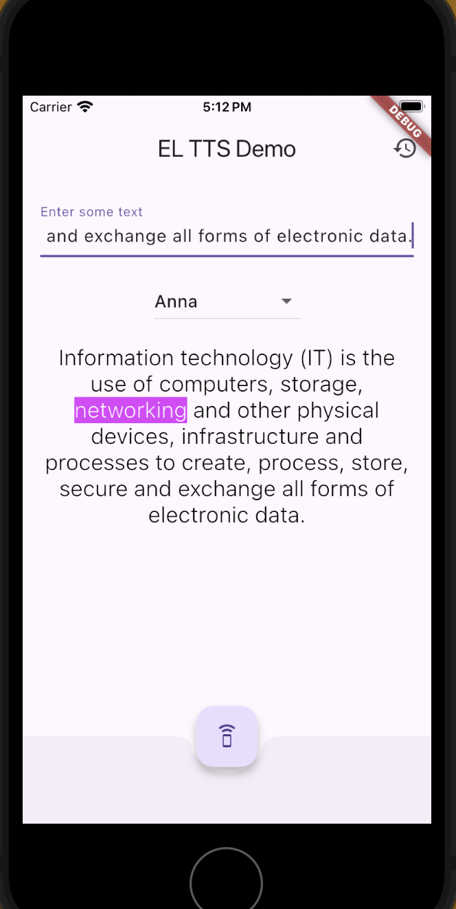
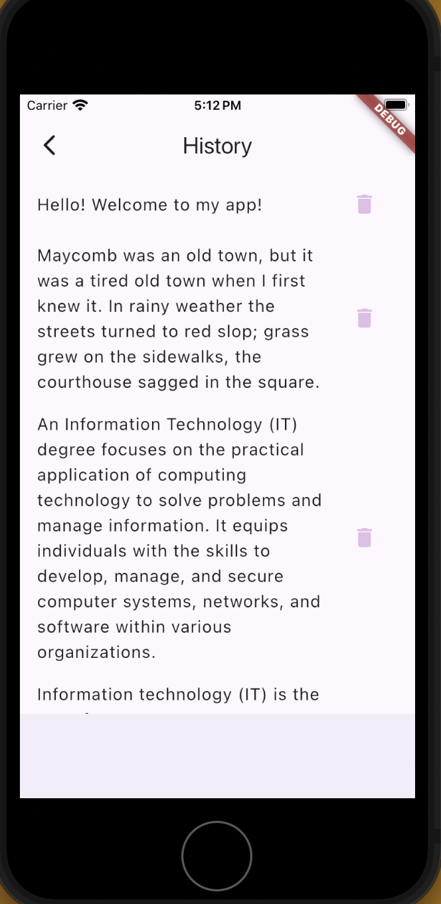

# 🗣️ Text-to-Speech Flutter App

A mobile app built with Flutter that converts input text into speech.  
Users can select from different voices, listen to the spoken text with real-time highlighting, and manage their playback history.

## ✨ Features

- 🔤 Input any text
- 🔊 Choose from multiple voices via dropdown
- 🎙️ Real-time word highlighting during speech
- 📝 Automatic history saving
- ♻️ Replay or delete items from history

## 📸 Screenshots

### Homepage demo

### History page demo

## 🛠️ Tech Stack

- **Flutter**
- **Dart**
- [flutter_tts](https://pub.dev/packages/flutter_tts) for text-to-speech functionality
- [provider](https://pub.dev/packages/provider) for state management (if applicable)
